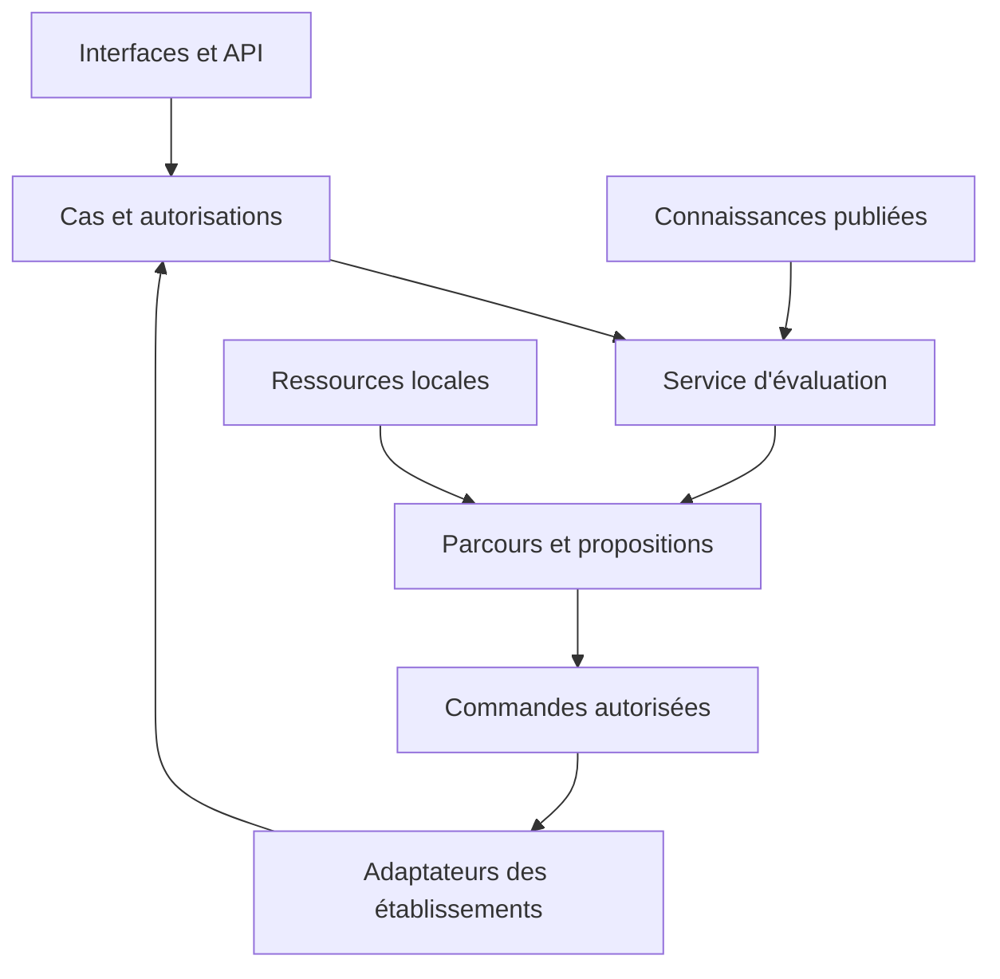

# 02 — Architecture et choix techniques

## Architecture cible

Le cœur est un monolithe modulaire avec un worker séparé utilisant les mêmes modules. Les moteurs JVM, probabilistes ou d'optimisation peuvent être des processus locaux isolés. Ils restent des adaptateurs remplaçables et non des propriétaires de données métier.

## Modules et propriété

| Module | Possède | Lit via contrat |
|---|---|---|
| identity | Comptes locaux, rôles, politiques et délégations | Assertions IdP facultatives |
| clinical_case | Cas, observations, versions et décisions du cas | Terminologies, droits |
| knowledge | Sources, assertions, preuves, publications | Révisions autorisées |
| inference | Exécutions, hypothèses et traces calculées | Snapshot du cas, modèles |
| pathways | Protocoles et propositions d'actions | Évaluation, connaissances |
| planning | Plans et comparaisons de stratégies | Actions admissibles, ressources |
| resources | Capacités, snapshots de disponibilité, coûts et réservations MediKristal | Reçus externes |
| treatment | Options thérapeutiques et évaluations de compatibilité | Cas, médicaments, protocoles |
| contributions | Propositions scientifiques et décisions de révision | Artefacts de connaissance |
| integrations | Operations, inbox/outbox et liaisons étrangères | Exports autorisés des propriétaires |
| audit | Journal technique d'accès et de mutations | Événements minimisés |

Un module n'importe pas le modèle ORM privé d'un autre pour le modifier. Les lectures optimisées intermodules passent par une projection documentée. Les contraintes transactionnelles communes peuvent être implémentées dans la même base, sans effacer la propriété.

## Choix de référence pour démarrer

Décisions d'architecture recommandées pour ce nouveau projet, pas dépendances déjà testées : Python 3.12 comme baseline d'exécution, FastAPI/Pydantic pour API et validation, PostgreSQL 16 comme baseline relationnelle, SQLAlchemy/Alembic pour persistance/migrations ; React/TypeScript pour les interfaces. Fixer les versions exactes après le lot L0. Une ADR peut remplacer ces choix avant le premier code, mais pas laisser deux piles concurrentes.

Les bibliothèques sont lockées avec hashes et SBOM. La version numérique d'une baseline n'est pas une affirmation qu'elle est la plus récente. Les mises à jour de sécurité sont sélectionnées et testées. CQF est exécuté derrière un port JVM ; son JDK est déterminé par la version sélectionnée et enregistré, pas imposé arbitrairement par le noyau.

PostgreSQL assure la vérité transactionnelle. Les fichiers immuables sont stockés sur disque local ou stockage objet compatible. Aucun Redis, serveur de graphe, moteur vectoriel, Kubernetes, cloud commercial ou GPU n'est obligatoire. Une file de jobs PostgreSQL avec lease, heartbeat et récupération après crash suffit initialement. SQLite n'est pas un second backend implicitement pris en charge : le profil poste autonome embarque le même service et PostgreSQL ; une version mobile exige un projet de synchronisation distinct.

## Disposition du dépôt futur

`backend/medikristal/domain/` types et invariants ; `application/` cas d'usage ; `infrastructure/` DB, fichiers et adaptateurs ; `api/` transport. `workers/`, `frontend/`, `adapters/cqf/`, `contracts/`, `examples/synthetic/`, `tests/`, `deploy/`, `docs/`, `licenses/` complètent le dépôt. Le dossier actuel est documentaire et ne simule pas cette application.

## Transactions

Un cas d'usage valide le principal, le tenant, la révision attendue et les invariants ; il écrit état et outbox dans une transaction. Les appels externes ont lieu après commit. Pas de transaction distribuée entre établissement, Kristal et MediKristal. Les lecteurs d'évaluation travaillent sur un snapshot immuable. Un retour tardif ne remplace jamais une version plus récente.

## Ports

Chaque adaptateur expose `capabilities`, `health`, versions supportées, classification des données admises, timeout et erreurs typées. Le noyau ne dépend pas d'une SDK commerciale. L'adaptateur ne décide jamais de l'autorisation d'une prescription ou de la reconnaissance d'une assertion. Les ports détaillés sont au chapitre 13.

## Registre de capacités

Une capacité est `available`, `degraded`, `unavailable`, `not_configured` ou `not_qualified`. Elle déclare connectivité requise, coût, licence de données, couverture clinique et preuve de qualification. Le frontend reflète ce registre ; il ne déduit pas la capacité de la seule présence d'un bouton.

## Limites et budgets techniques initiaux

Budgets d'ingénierie configurables : payload JSON 2 MiB, page 100 éléments maximum, temps d'évaluation interactive 10 s avant traitement asynchrone, taille et complexité des modèles plafonnées, résultats de recherche 50 par défaut. Ces budgets ne sont pas des seuils cliniques. Tester sur un poste de référence déclaré dans les résultats de performance ; ne pas revendiquer de débit sans mesure.
